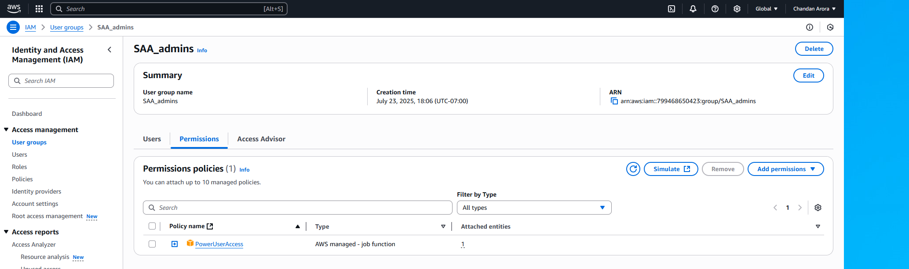
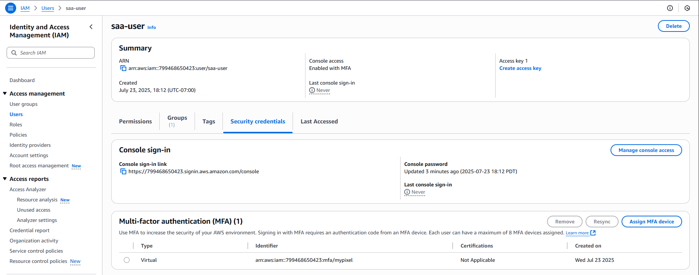

# Task 01 – IAM User and Group Setup

This task was about setting up the foundational IAM structure needed to securely manage access to AWS services — without touching the root account again.

---

## 🎯 Objectives

- Create an IAM group (`SAA_admins`) with `PowerUserAccess`
- Create a user (`saa-user`) and add it to the group
- Enable MFA for the IAM user
- Log in using IAM credentials instead of root

---

## 🛠️ What I Did

1. **Created IAM Group**
   - Name: `SAA_admins`
   - Attached AWS managed policy: `PowerUserAccess`

2. **Created IAM User**
   - Username: `saa-user`
   - Enabled both console and programmatic access
   - Assigned the user to `SAA_admins` group
   - Downloaded the `.csv` file with access keys (for CLI)

3. **Set Up MFA**
   - Used a virtual MFA device (Google Authenticator app)
   - Enabled and tested MFA successfully

4. **Signed In**
   - Logged into AWS Console with the IAM credentials
   - Verified that root account was no longer needed for day-to-day use

---

## 📸 Screenshots

| Action                    | Screenshot Preview                            |
|---------------------------|-----------------------------------------------|
| Group with PowerUserAccess |                  |
| MFA enabled for IAM user   |               |

---

## 🔐 Security Notes

- Root account was used only for initial setup
- IAM user (`saa-user`) was secured with MFA
- Access keys are stored securely — not hardcoded in scripts

---

## ⏭️ Next Task

[Task 02 → EC2 Launch & SSH Access](../task-02-launch-EC2-instance/README.md)
