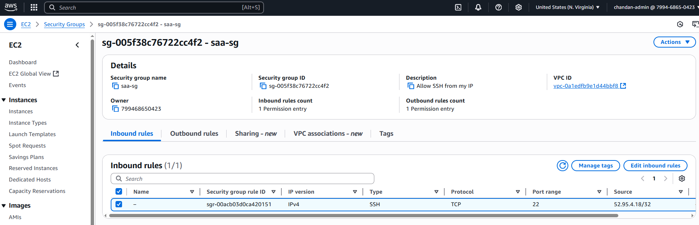

# Task 02 – Launch EC2 Instance and Connect via SSH

This task involved launching a virtual machine (Amazon EC2) and connecting to it securely via SSH.

---

## 🎯 Objectives

- Launch an EC2 instance using Amazon Linux 2023
- Generate and use a key pair for secure access
- Configure security group to allow SSH from my IP
- Connect to the instance using a terminal
- Terminate instance after testing

---

## 🧰 Tools & Services

- **Amazon EC2**
- **Key Pair** (`.pem` file)
- **Security Group** (port 22 open)
- **SSH Terminal** or **PuTTY** (Windows)

---

## 🛠️ What I Did

### 1. Launched EC2 Instance

- **Service**: EC2 → Launch Instance
- **Name**: `saa-ec2-instance`
- **AMI**: Amazon Linux 2023 (64-bit x86)
- **Instance Type**: `t3.micro` (Free Tier)
- **Key Pair**: `saa-key.pem` (downloaded)
- **Network Settings**:
  - Auto-assign Public IP: ✅ Enabled
  - Inbound Rule: SSH (port 22) from **My IP**
- **Storage**: 8 GB (default)
- ✅ Clicked **Launch Instance**

---

### 2. Updated Security Group (If Needed)

- Navigated to **Security Groups**
- Edited **Inbound Rules**:
  - **Type**: SSH
  - **Source**: My IP
- ✅ Saved changes

---

### 3. Connected via SSH

#### Using Terminal (Linux/macOS or Git Bash):
bash
ssh -i "saa-key.pem" ec2-user@<EC2_PUBLIC_IP>

### Using PuTTY (Windows):
Converted .pem → .ppk using PuTTYgen

PuTTY Settings:

Host Name: ec2-user@<EC2_PUBLIC_IP>

Auth → Browse for .ppk

✅ Opened SSH session

### 4. Verified Connection (Optional)
Ran the following commands:
---
uname -a
sudo yum update -y

### 5. Terminated the Instance
Went to EC2 Dashboard

Selected instance

Clicked Instance State → Terminate

✅ Confirmed termination

| Action                      | Screenshot Preview                      |
| --------------------------- | --------------------------------------- |
| EC2 instance launched    |  |
| Inbound SSH rule configured |      |
| Connected via SSH |  |

### 🔒 Security Notes
Key pair .pem stored securely, never committed to Git

Port 22 open only to my IP

Instance was terminated after verification
## ⏭️ Next Task

[Task 03 → S3 Public Access & Bucket Policy](../task-03-s3-public-access/README.md)

