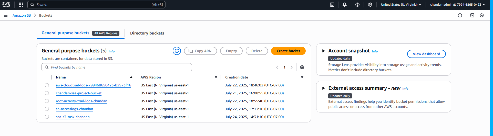
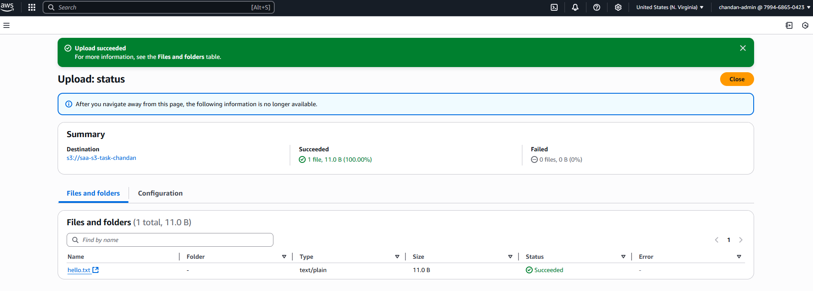
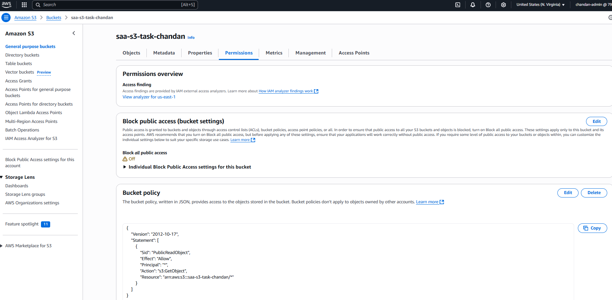
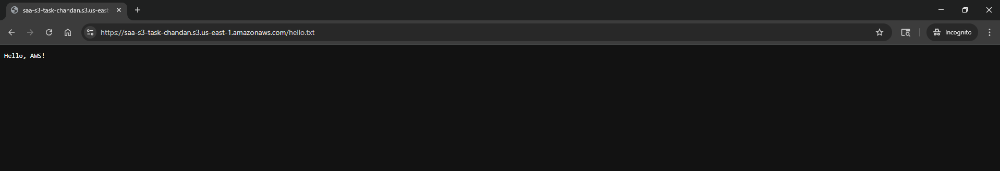

# Task 03 – S3 Public Access (AWS SAA Hands-on)

## 🎯 Objective:
Upload a text file to an S3 bucket and make it publicly accessible via a web browser.

---

## 📌 Steps Performed:

### ✅ 1. Create S3 Bucket
- **Bucket Name**: `saa-s3-task-chandan`
- **Region**: `us-east-1` (N. Virginia)
- **Block Public Access**: ❌ *Unchecked* “Block all public access”
- 📸 Screenshot: `bucket-creation.png`

---

### ✅ 2. Upload a File
- **File uploaded**: `hello.txt`
- **Content**: `Hello from AWS SAA Prep!`
- 📸 Screenshot: `file-upload.png`

---

### ❌ 3. Attempted ACL Access (Fails due to Bucket Owner Enforced)
- **Object Ownership** is set to *"Bucket owner enforced"*
- ACL-based public access is **not allowed**
- 📸 Screenshot: `bucket-policy.png`

---

### ✅ 4. Applied Bucket Policy to Allow Public Read Access
**Policy Used:**
```json
{
  "Version": "2012-10-17",
  "Statement": [
    {
      "Sid": "PublicRead",
      "Effect": "Allow",
      "Principal": "*",
      "Action": "s3:GetObject",
      "Resource": "arn:aws:s3:::saa-s3-task-chandan/*"
    }
  ]
}
````
### Applied via: Permissions → Bucket Policy

📸 Screenshot: bucket-policy.png

### ✅ 5. Verified Public Access
Opened file URL:
http://saa-s3-task-chandan.s3.amazonaws.com/hello.txt

Successfully viewed contents in browser

📸 Screenshot: text-file-public-access.png

## 📸 Screenshots

### 🪣 Bucket created  


### 📁 File uploaded  


### 🔓 Public access via bucket policy  


### 🌐 Verified in browser  


### ✅ Outcome:
S3 file successfully made public using Bucket Policy, not ACL.

🔐 Security Tip:
Avoid allowing public access unless absolutely necessary.
This task is for educational/demo purposes only.

⏭️ Next Task
[Task 04 → Lambda Hello World (Trigger via Console)]
