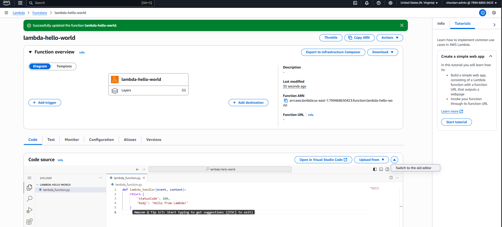
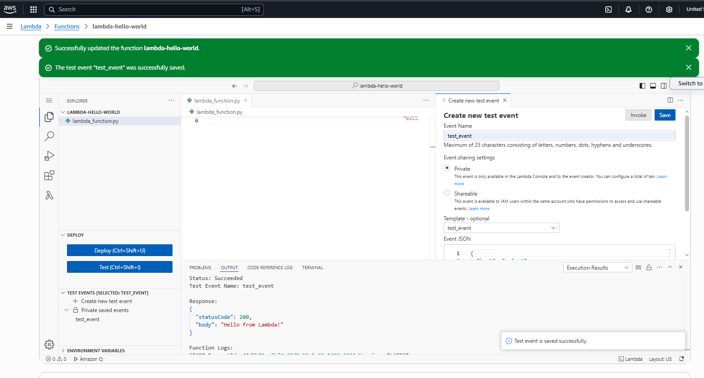

# Task 04 – Deploy a Lambda Function (Hello World)

## 🎯 Objective
Deploy a basic AWS Lambda function using the AWS Console that returns the message:  
`"Hello from Lambda!"`

---

## ✅ Steps Performed

### 1. Access Lambda Console
- Open AWS Console → **Services → Lambda**
- Click **Create function**

---

### 2. Configure the Function
- **Author from scratch**
  - Function name: `lambda-hello-world`
  - Runtime: `Python 3.12`
  - Architecture: `x86_64`
  - Permissions: Create a new role with basic Lambda permissions

 
📸 Screenshot:  


---

### 3. Add Code to Lambda

Replaced default code with:

```python
def lambda_handler(event, context):
    return {
        'statusCode': 200,
        'body': 'Hello from Lambda!'
    }
```
### 4. Test the Function
Click Deploy

Go to the Test tab

Create a new test event with default template

Click Test

✅ Output:

{
  "statusCode": 200,
  "body": "Hello from Lambda!"
}

### 🧹 Clean-Up
This Lambda function runs under the free tier

You can delete it via Actions → Delete if no longer needed
### 🧠 Notes
AWS Lambda allows you to run code without provisioning servers

Ideal for event-driven applications and microservices

This was a basic "Hello World" deployment
→ Upcoming tasks will explore S3 triggers and API Gateway

## 🖼️ Screenshots

| Action               | Screenshot                                    |
|----------------------|-----------------------------------------------|
| Function created     |                 |
| Code added           |                     |
| Test output verified |             |


