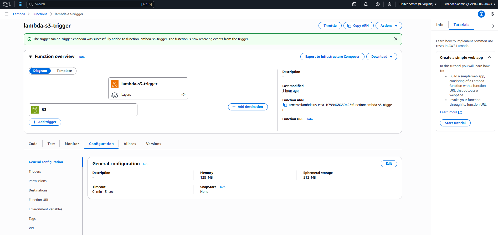

# Task 05 – AWS Lambda Triggered by S3

## 📌 Goal

Demonstrate how to invoke a Lambda function automatically when a file is uploaded to an Amazon S3 bucket.

---

## ✅ Steps Performed

### 1. Create an S3 Bucket

* Bucket name: `saa-s3-trigger-chandan` *(or similar)*
* Region: `us-east-1`
* Created a folder named `input` inside the bucket (optional).

🖼️ **Screenshot:**


---

### 2. Create a Lambda Function

* Runtime: **Python 3.12**
* Function name: `s3-trigger-lambda`
* Permissions:

  * Lambda execution role includes:

    * `AWSLambdaBasicExecutionRole`
    * `AmazonS3ReadOnlyAccess` *(optional for reading object metadata)*

🖼️ **Screenshot:**


---

### 3. Add Code to Lambda

```python
def lambda_handler(event, context):
    print("Lambda triggered by S3 upload event")
    print(event)
    return {
        'statusCode': 200,
        'body': 'Success'
    }

```
🖼️ **Screenshot:**  

#### CloudWatch logs confirm the Lambda function was triggered and executed successfully upon S3 upload.
---

### 4. Add S3 Trigger to Lambda

* Triggered by: PUT event
* Prefix: `input/`
* Bucket: Same region as Lambda
* Acknowledged recursive warning

✅ Trigger added successfully

🖼️ **Screenshot:**


---

### 5. Test the Trigger

* Uploaded a file (e.g., `input.txt`) into the `input/` folder of the bucket
* Lambda triggered automatically

🖼️ **Screenshot:**


---

### 6. Verify Logs in CloudWatch

CloudWatch log stream confirmed:

* Lambda was invoked
* Event details were printed
* Execution duration and memory usage shown

🖼️ **Screenshot:**


---

## 📚 Learnings

* Lambda can automatically respond to S3 events
* Avoid recursive triggers (don’t write output to same path that triggers Lambda)
* CloudWatch is crucial for debugging

---

✅ **Status:** Completed Successfully
